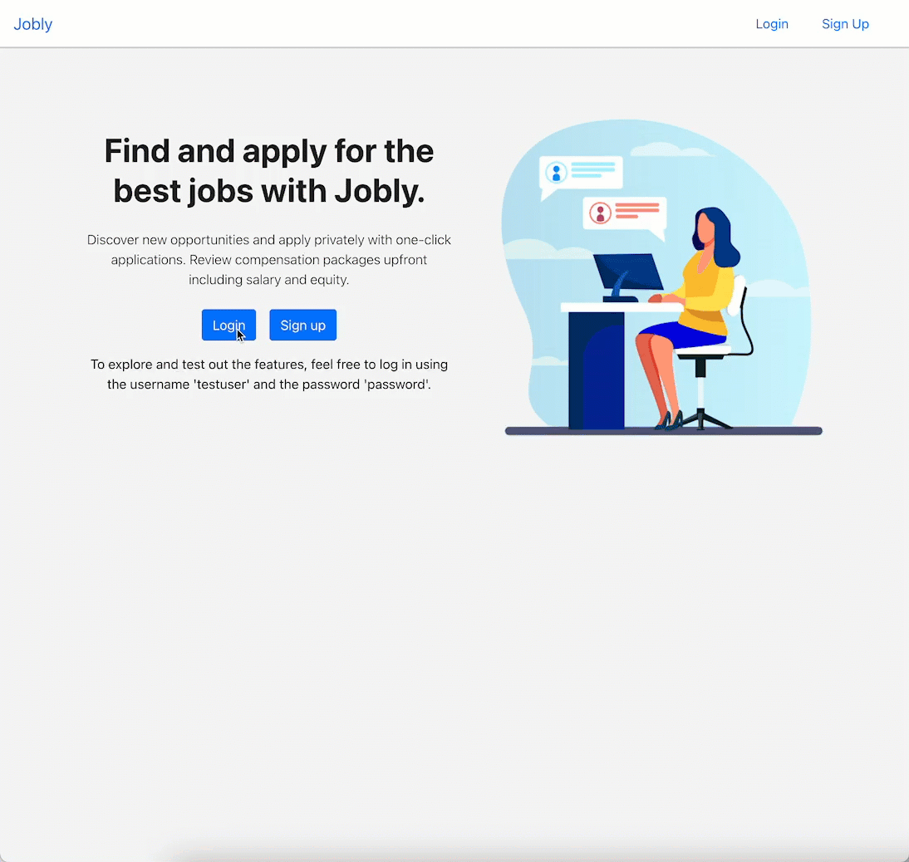

# Jobly

Jobly is a web application built using React that allows users to search and apply for job listings. Users can sign up, log in, and update their profile information. 

## Features
- User authentication and authorization
- Search for jobs by keyword or company name
- View job details, including salary and equity
- Apply to jobs
- View jobs applied to by the user

## Getting Started
To get started with Jobly, follow the steps below:

### Backend
1. Clone the repository to your local machine.
2. Navigate to the backend directory: `cd backend`.
3. Install backend dependencies with `npm install`.
4. Start the backend server with `npm start`.
5. The backend server will start running at `http://localhost:3001`.

### Frontend
1. Open a new terminal.
2. Navigate to the frontend directory: `cd frontend`.
3. Install dependencies with `npm install`.
4. Start the frontend development server with `npm start`.
5. Open `http://localhost:3000` in your browser.

## Testing
Tests are run using Jest. To run the tests for both the frontend and backend, follow the steps below:

### Backend Tests
1. Open a terminal.
2. Navigate to the backend directory: `cd backend`.
3. Run `npm test` to execute the backend tests.

### Frontend Tests
1. Open a new terminal.
2. Navigate to the frontend directory: `cd frontend`.
3. Run `npm test` to execute the frontend tests.

## Dependencies
Backend:
* express
* cors
* dotenv
* jsonwebtoken
* bcrypt
* jest
* supertest

Frontend:
* axios
* bootstrap
* react
* react-dom
* react-router-dom
* react-scripts
* reactstrap